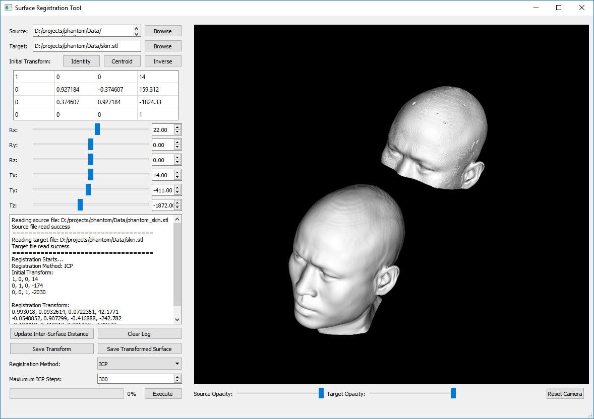

# Surface Registration Tool

This software register two surface meshes by iterative closest point method.

GUI Screenshot: 

## Usage
The program includes both GUI and commandline interface. IO supports STL,VTP and VTK format.

CLI is under development.

## Compile for source
Required Packages:
1. CMake
2. VTK
3. ITK
4. Qt 5 

### Compilation Steps
1. Run CMake and specify ITK, VTK, Qt build folders when requested.
2. Generate Projects (MSVC solution/ UNIX Makefiles)
3. Compile and Run

Compilation tested on Windows 10 with MSVC 2015. Test on your own for other platforms and compilers.

## Initial Transform
Registration initialization is specified by user matrix displayed in the 4x4 matrix table.
User may alter the transformation directly on the matrix table or by changing the sliders.

## Registration Methods
The surface first passthrough the initial transform matrix, then registered by following algorithms:

1. Iterative Closest Point (ICP)

	Users may refer to the documentation [here](https://www.vtk.org/doc/nightly/html/classvtkIterativeClosestPointTransform.html)

2. Principal Component Analysis / Iterative Closest Point (PCA-ICP)

	PCA is adopted for initialization then implement ICP registration. Suitable for asymmetric surfaces. Much computation expensive than method 1. Recommended for registering surfaces with small number of points.

3. Iterative Closest Point by ITK (ITK-ICP)

	ICP implemented by surface points as fudicial landmarks. Generally faster method than PCA-ICP but converge speed is inconsisent for same surface pairs. Recommended for registering surfaces with small number of points. Users may refer to the documentation [here](https://itk.org/Doxygen/html/classitk_1_1PointSetToPointSetRegistrationMethod.html)

## Inter-Surface Distance Calulation
Available in GUI mode with one-shot calculation to visualize localized inter-surface distance. The colormap will be removed whenever the source is moved.

## Test Files
Test surfaces could be found in [data folder](./data)